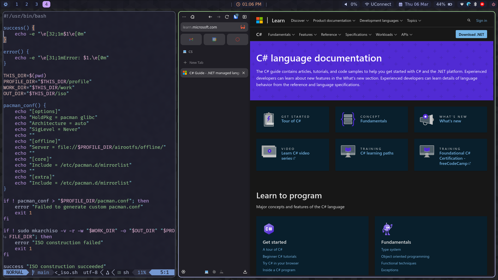

# NixOS config

This is my NixOS config for daily driving. This includes NixVim, a neovim distro based on NIX.

I am using homemanager for userspace management. LOOK UP PROPER README FORMATTING AAA

# Screenshots:




[Nixvim Config](/user/programs/nixvim)

## Quick start

1. Acquire or build a NixOS 24.05+ image:
   ```sh
   # Yoink nixos-unstable from upstream
   $ wget -O nixos.iso https://channels.nixos.org/nixos-unstable/latest-nixos-minimal-x86_64-linux.iso
   ```
2. Install on machine

3. Clone these dotfiles somewhere:

   ```sh
   $ git clone --recursive https://github.com/zainkergaye/nixosdotfiles
   ```

4. Build the system:

   ```sh
   # Ensure flakes are enabled before too
   $ sudo nixos-rebuild switch --flake .
   ```

5. Then reboot and you're good to go!

> [!WARNING]
> Don't forget to change the user and hostname, both are in many places in the config.
