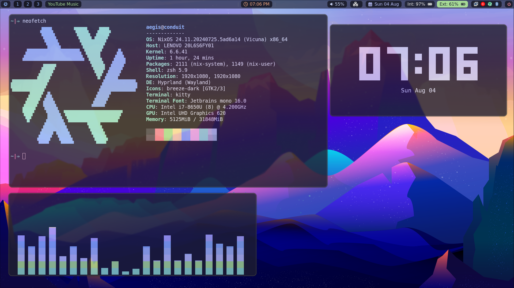
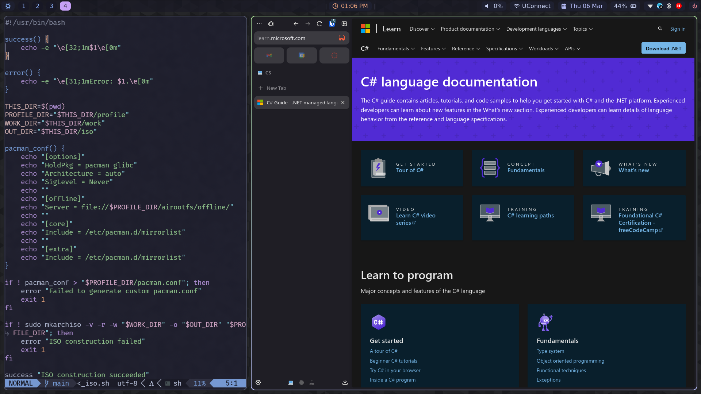

# NixOS config

This is my NixOS config, I daily drive it with multiple machines. Contains a configuration
for NixOS and Home-Manager using [Flakes](https://nixos.wiki/wiki/Flakes), Hyprland, Kitty,
Zsh, and so many more programs.

# Previews

