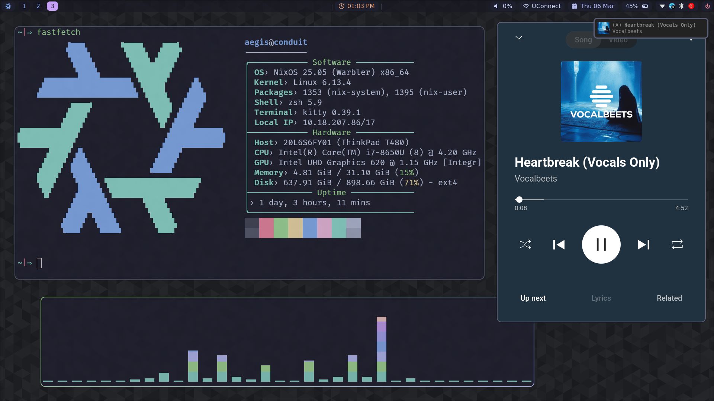

# New NixOS config

This is my new NixOS config for dev, and everything else. Using flakes and home-manager.

# Screenshots:

## Dev environments

To configure whatever environment, you can use this command:
nix flake init --template github:the-nix-way/dev-templates#java

Look at the-nix-way/dev-templates

## To implement

[ ] Sleep at 15 mins
[ ] Suspend at 1 hr

## Bugs

- [x] Floating window rules Hyprland
- - [x] notepad next
- - [ ] save file
- - [ ] open file
- [ ] Discord screen sharing
- [ ] Fingerprint enabled login
- [ ] Nixvim
- - [ ] <Leader> ra -> needs to rename current highlighted variable, doesn't work yet.
- [ ] See if an opened window class can stay there? Like opening steam and moving to another window
